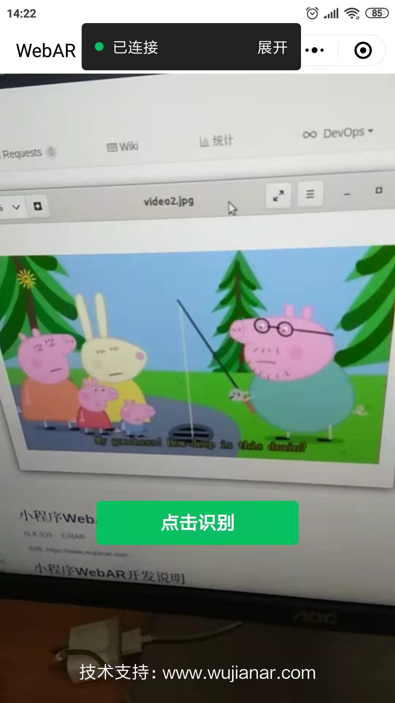
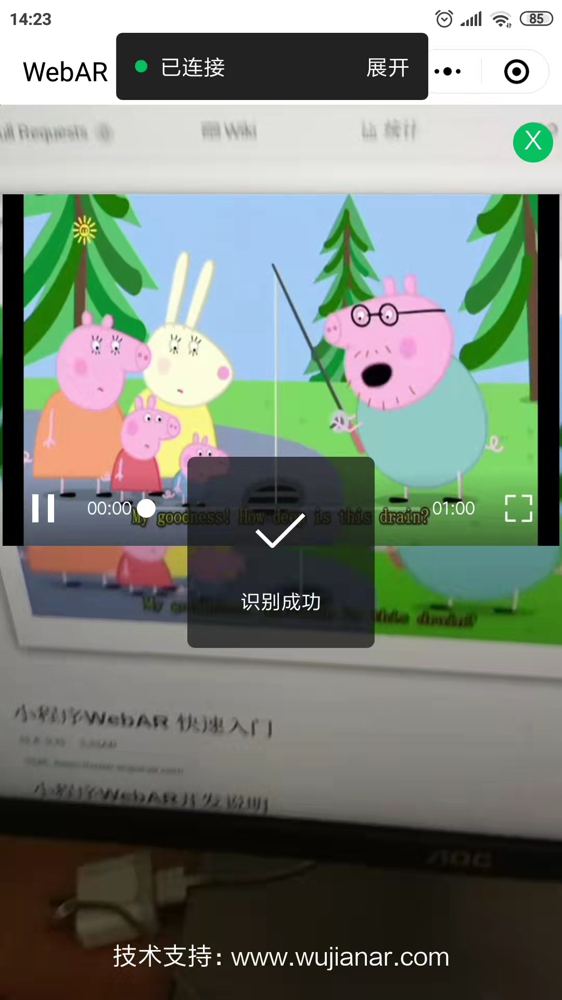

# 小程序WebAR AR相册开发

技术支持：无间AR

官网: [https://www.wujianar.com](https://www.wujianar.com)


# 小程序AR相册开发

* 识别图片在 marker 目录
* 视频地址保存在云识别的关联信息中，不同识别图播放不同视频

## 1. 登录无间AR官网上传识别

登录 [https://www.wujianar.com](https://www.wujianar.com), 在识别图的关联信息中填入视频的播放地址，如：
```javascript
{"videoUrl":"https://********/1.mp4"}
```

## 2. 下载官方提供的demo代码

https://github.com/wujianar/mini-webar

## 3. 设置认证token等

从开发中心复制认证token

```javascript
const CONFIG = {
    token: 'YTU5NjgxYz5********', // 认证token, 请从开发者中心获取
    endpoint: 'https://iss-cn1.wujianar.com',
    quantity: 0.7, // 图片压缩质量, 0~1
    interval: 1000, // 识别间隔(毫秒)
}
```

## 4. 使用真机调试，扫描marker目录的中识别就可以播放视频





## 5. 代码下载

[示例下载: https://github.com/wujianar/mini-webar-album](https://github.com/wujianar/mini-webar-album)